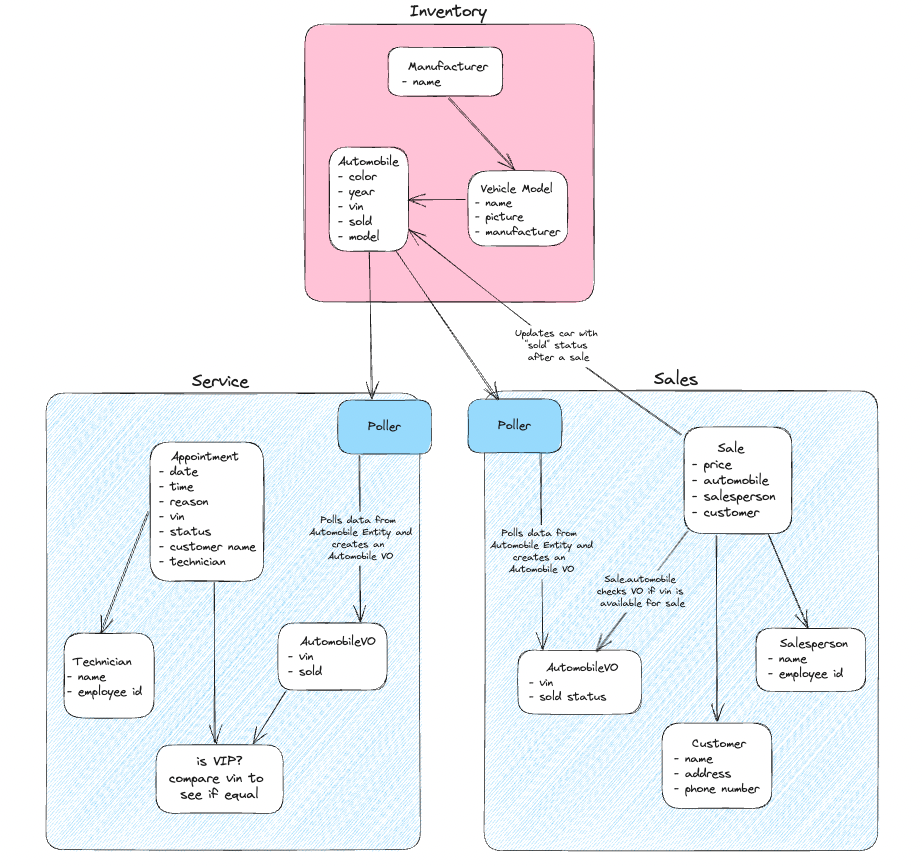

# CarCar
CarCar is an application for managing aspects of an automobile dealership— specifically its inventory, service center, and sales.


#### Team:

* Brian La - Service
* Emily Yim - Sales

## Design



If image is not available, please see the following link:
https://excalidraw.com/#room=c98d494342d2014b7cb7,kkOw0OFvQTm1WgK75rRNUQ

## Service microservice

Purpose of this microservice is to keep track of service appointments for automobiles and their owners.

##### Models:
* Technician: first name, last name, and employee id
* AutomobileVO: will poll the 'vin' and 'sold' fields from Automobile model in inventory and will be used for the special feature.
* Appointment: Keeps track of date/time, reason, status, vin, customer name, technician (selected from technician model), and will gather extra data to compare if the customer's vin matches a vin from the automobileVO so that we know if they are a VIP.

##### Special Feature:
* If the VIN in the appointment matches a VIN from the AutomobileVO, then it means that it was sold through us and are considered a VIP.

## Sales microservice

The purpose of this microservice is to keep track of automobile sales that come from the inventory. A salesperson cannot sell a car that isn't list in the inventory, nor can they sell a car that has already been sold.

On the backend, I created models for Salesperson, Customer, Sale, and Automobile VO. Implemented a poller to poll automobile data from the inventory. Created React components on the frontend allowing user to add a Salesperson, list all Salespeople, add a Customer, list all Customers, add a new Sale, list all Sales, and view a salesperson's sale history.

##### Models:
* Salesperson: first name, last name, and employee ID
* Customer: first name, last name, address, and phone number
* Sale: price, automobile, salesperson, and customer. Created a special feature to ensure that only automobiles that have not been sold are available to sell.
* AutomobileVO: works with the poller to pole the VIN and sold status. This is what makes the special feature possible


## Getting Started
*for this project we used git, Docker, and Insomnia*

* Fork from repository at https://gitlab.com/emilyvictany/car-dealership
* Setup Gitlab if you need to add members
* Clone with `git clone` to your local computer
    * Use HTTPS if SSH has not been set up
	* after cloning, we used `code .` to open project in **VS Code**
* Run the following commands in **Docker** on your computer
    1. `docker volume create beta-data`
    2.  `docker-compose build`
    3.  `docker-compose up`


## Inventory Monolith CRUD
* Build a CRUD for the Inventory Monolith
* From **Insomnia** and your browser, you can access the manufacturer endpoints at the following URLs.
CRUD will be listed in the following structure:

### Manufacturers CRUD
| Action | Method | URL
| ----------- | ----------- | -----------|
| List manufacturers | GET | http://localhost:8100/api/manufacturers/
| Create a manufacturer | POST | http://localhost:8100/api/manufacturers/
| Get a specific manufacturer | GET | http://localhost:8100/api/manufacturers/:id/
| Update a specific manufacturer | PUT | http://localhost:8100/api/manufacturers/:id/
| Delete a specific manufacturer | DELETE | http://localhost:8100/api/manufacturers/:id/

<details>
<summary markdown="span"> Creating or updating manufacturer example </summary>

```
{ "name": "Chrysler" }
```
</details>

### Vehicle models CRUD
| Action | Method | URL
| ----------- | ----------- | -----------|
|List vehicle models|GET|http://localhost:8100/api/models/
|Create a vehicle model|POST|http://localhost:8100/api/models/
|Get a specific vehicle model|GET|http://localhost:8100/api/models/:id/
|Update a specific vehicle model|PUT|http://localhost:8100/api/models/:id/
|Delete a specific vehicle model|DELETE|http://localhost:8100/api/models/:id/

<details>
<summary markdown="span">Create a vehicle model example</summary>

```
{
    "name": "Sebring",
    "picture_url": "https://upload.wikimedia.org/wikipedia/commons/thumb/7/71/Chrysler_Sebring_front_20090302.jpg/320px-Chrysler_Sebring_front_20090302.jpg",
    "manufacturer_id": 1
}
```
</details>

<details>
<summary markdown="span">Update a vehicle model example</summary>

```
{
    "name": "Sebring",
    "picture_url": "https://upload.wikimedia.org/wikipedia/commons/thumb/7/71/Chrysler_Sebring_front_20090302.jpg/320px-Chrysler_Sebring_front_20090302.jpg"
}
```
</details>

### Automobile information CRUD
| Action | Method | URL
| ----------- | ----------- | -----------|
|List automobiles|GET|http://localhost:8100/api/automobiles/
|Create an automobile|POST|http://localhost:8100/api/automobiles/
|Get a specific automobile|GET|http://localhost:8100/api/automobiles/:vin/
|Update a specific automobile|PUT|http://localhost:8100/api/automobiles/:vin/
|Delete a specific automobile|DELETE|http://localhost:8100/api/automobiles/:vin/

<details>
<summary markdown="span">Create an automobile example</summary>

```
{
  "color": "red",
  "year": 2012,
  "vin": "1C3CC5FB2AN120174",
  "model_id": 1
}
```
</details>

<details>
<summary markdown="span">Update an automobile example</summary>

```
{
  "color": "red",
  "year": 2012,
  "sold": true
}
```
</details>

## Service Microservice CRUD:


Build a CRUD for the Service Microservice using the following URLs.
| Action | Method | URL
| ----------- | ----------- | -----------|
|List technicians|GET|http://localhost:8080/api/technicians/
|Create a technician|POST|http://localhost:8080/api/technicians/
|Delete a specific technician|DELETE|http://localhost:8080/api/technicians/:id/
|List appointments|GET|http://localhost:8080/api/appointments/
|Create an appointment|POST|http://localhost:8080/api/appointments/
|Delete an appointment|DELETE|http://localhost:8080/api/appointments/:id/
|Set appointment status to "canceled"|PUT|http://localhost:8080/api/appointments/:id/cancel/
|Set appointment status to "finished"|PUT|http://localhost:8080/api/appointments/:id/finish/
|AutomobileVO List (for poll testing)|GET|http://localhost:8080/api/automobilesVO/

<details>
<summary markdown="span">Create Appointment Example</summary>
To create an appointment, here is an example of a JSON body to send:

```
{
	"date_time" : "2023-7-28 10:30",
	"reason" : "full repair",
	"status" : "created",
	"vin" : "QWEASD123",
	"customer": "Mike Ike",
	"technician" : "ffelix"
}
```
</details>

<details>
<summary markdown="span">Update to Cancel Appointment Example</summary>
After selecting which appointment to cancel by putting the appointment ID in the URL, the successful response should look like this:

```
{ "status" : "canceled" }
```
</details>

<details>
<summary markdown="span">Update to Finish Appointment Example</summary>
After selecting which appointment to complete by putting the appointment ID in the URL, the successful response should look like this:

```
{ "status" : "finished" }
```
</details>

<details>
<summary markdown="span">Create a Technician Example</summary>
To create a Technician, here is an example of a JSON body to send:

```
{
	"first_name" : "Fixit",
	"last_name" : "Felix",
	"employee_id" : "ffelix"
}
```
</details>


## Sales Microservice CRUD


### Customers CRUD
| Action | Method | URL
| - | - | - |
| Create a customer | POST | http://localhost:8090/api/customer/
| List customers | GET | http://localhost:8090/api/customers/
| Delete a customer | DELETE | http://localhost:8090/api/customers/id/

<details>
<summary markdown="span">Creating a customer</summary>
To create a customer, here is an example of a JSON body to send:

```
{
    "first_name": "London",
    "last_name": "Breed",
    "address": "1 Dr Carlton B Goodlett Pl San Francisco, CA 94102",
    "phone_number": "415-554-4000"
}
```
and the response should look like this:
```
{
	"id": 1,
	"first_name": "London",
	"last_name": "Breed",
	"address": "1 Dr Carlton B Goodlett Pl San Francisco, CA 94102",
	"phone_number": "415-554-4000"
}
```
</details>

<details>
<summary markdown="span">Listing all customers</summary>
After sending a GET request to list all customer, the return value should look something like this:

```
{
	"customers": [
		{
			"id": 1,
			"first_name": "London",
			"last_name": "Breed",
			"address": "1 Dr Carlton B Goodlett Pl San Francisco, CA 94102",
			"phone_number": "415-554-4000"
		},
		{
			"id": 2,
			"first_name": "Sheng",
			"last_name": "Thao",
			"address": "1 Frank H. Ogawa Plaza Oakland, CA 94612",
			"phone_number": "510-238-7001"
		},
		{
			"id": 3,
			"first_name": "Matt",
			"last_name": "Mahan",
			"address": "200 E Santa Clara St San Jose, CA 95113",
			"phone_number": "408-535-3500"
		},
	]
}
```
</details>

<details>
<summary markdown="span">Deleting a customer</summary>
After selecting which customer to delete by putting the customer ID in the URL, the successful response should look like this:

```
{
  "deleted": true
}
```
</details>

### Salesperson CRUD
| Action | Method | URL
| - | - | - |
| Create a salesperson | POST | http://localhost:8090/api/salesperson/
| List all salespeople | GET | http://localhost:8090/api/salespeople/
| Delete a salesperson | DELETE | http://localhost:8090/api/salesperson/id/

<details>
<summary markdown="span">Creating a salesperson:</summary>
To create a salesperson, here is an example of a JSON body to send:

```
{
    "first_name": "Shay",
    "last_name": "Mitchell",
    "employee_id": "SMitchell"
}
```
and the response should look like this:
```
{
	"id": 1,
	"first_name": "Shay",
	"last_name": "Mitchell",
	"employee_id": "SMitchell"
}
```
</details>

<details>
<summary markdown="span">Listing all salespeople</summary>
After sending a GET request to list all salespeople, the return value should look something like this:

```
{
    "salespeople": [
		{
			"id": 1,
			"first_name": "Shay",
			"last_name": "Mitchell",
			"employee_id": "SMitchell"
		},
		{
			"id": 2,
			"first_name": "Chris",
			"last_name": "Evans",
			"employee_id": "CEvans"
		},
		{
			"id": 3,
			"first_name": "Ashley",
			"last_name": "Benson",
			"employee_id": "ABenson"
		}
	]
}
```
</details>

<details>
<summary markdown="span">Deleting a salesperson</summary>
After selecting which salesperson to delete by putting the salesperson's ID in the URL, the successful response should look like this:

```
{
    "deleted": true
}
```
</details>

### Sales CRUD

| Action | Method | URL
| - | - | - |
| Create a sales | POST | http://localhost:8090/api/sales/
| List all sales | GET | http://localhost:8090/api/sales/
| Delete a sale | DELETE | http://localhost:8090/api/sales/id/

<details>
<summary markdown="span">Creating a sale</summary>

To create a sale, we use the automobile's VIN for the automobile, the employee's ID for the salesperson, and the customer's ID for customer.

After every successful sale, a PUT request is sent to the Inventory microservice to update an automobile's sold status. This integration ensures that a salesperson cannot list a car that has already been sold.

Here is an example of a JSON body to send:

```
{
    "price": "32456",
    "automobile": "1J4FF48S6YL241653",
    "salesperson": "SMitchell",
	"customer": "1"
}
```
and the response should look like this:
```
{
	"id": 1,
	"price": "32456",
	"automobile": {
		"vin": "1J4FF48S6YL241653",
		"sold": true
	},
	"salesperson": {
		"id": 1,
		"first_name": "Shay",
		"last_name": "Mitchell",
		"employee_id": "SMitchell"
	},
	"customer": {
		"id": 1,
		"first_name": "London",
		"last_name": "Breed",
		"address": "1 Dr Carlton B Goodlett Pl San Francisco, CA 94102",
		"phone_number": "415-554-4000"
	}
}
```
</details>

<details>
<summary markdown="span">Listing all sales</summary>
After sending a GET request to list all sales, the return value should look something like this:

```
{
	"sales": [
        {
            "id": 1,
            "price": "32456",
            "automobile": {
                "vin": "1J4FF48S6YL241653",
                "sold": true
            },
            "salesperson": {
                "id": 1,
                "first_name": "Shay",
                "last_name": "Mitchell",
                "employee_id": "SMitchell"
            },
            "customer": {
                "id": 1,
                "first_name": "London",
                "last_name": "Breed",
                "address": "1 Dr Carlton B Goodlett Pl San Francisco, CA 94102",
                "phone_number": "415-554-4000"
            }
        },
		{
			"id": 2,
			"price": 28650,
			"automobile": {
				"vin": "4T1BF1FK8CU165714",
				"sold": true
			},
			"salesperson": {
				"id": 2,
				"first_name": "Chris",
				"last_name": "Evans",
				"employee_id": "CEvans"
			},
			"customer": {
                "id": 2,
                "first_name": "Sheng",
                "last_name": "Thao",
                "address": "1 Frank H. Ogawa Plaza Oakland, CA 94612",
                "phone_number": "510-238-7001"
			}
		}
	]
}
```
</details>

<details>
<summary markdown="span">Deleting a salesperson</summary>
After selecting which sale to delete by putting the sale ID in the URL, the successful response should look like this:

```
{
  "deleted": true
}
```
</details>
